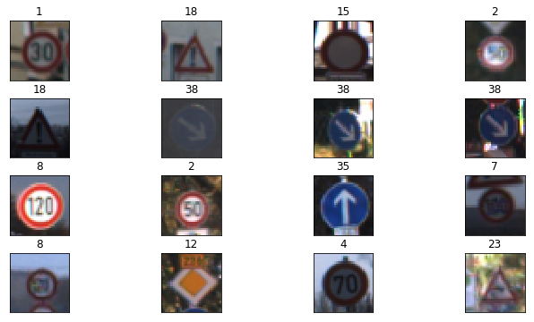
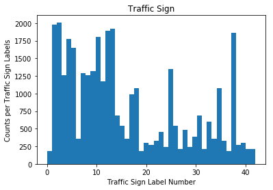
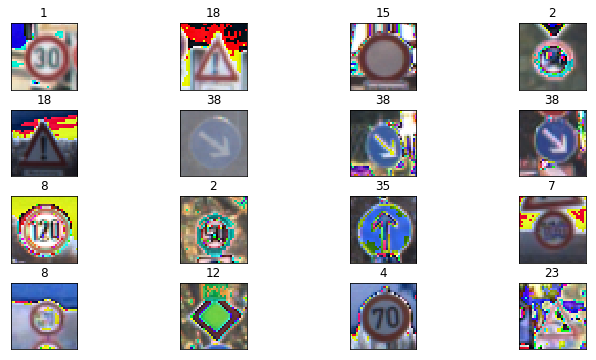
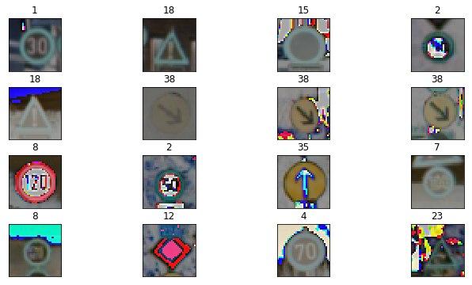

#*Writeup CarND-Traffic-Sign-Recognition** 

---

**Build a Traffic Sign Recognition Project**

The goals / steps of this project are the following:
* Load the data set (see below for links to the project data set)
* Explore, summarize and visualize the data set
* Design, train and test a model architecture
* Use the model to make predictions on new images
* Analyze the softmax probabilities of the new images
* Summarize the results with a written report

[//]: # "Image References"

[image1]: ./examples/visualization.jpg "Visualization"
[image2]: ./examples/grayscale.jpg "Grayscaling"
[image3]: ./examples/random_noise.jpg "Random Noise"
[image4]: ./writeup_data/extra_signs_plot.png "Extra"
[image5]: ./examples/placeholder.png "Traffic Sign 2"
[image6]: ./examples/placeholder.png "Traffic Sign 3"
[image7]: ./examples/placeholder.png "Traffic Sign 4"
[image8]: ./examples/placeholder.png "Traffic Sign 5"


## Rubric Points
###Here I will consider the [rubric points](https://review.udacity.com/#!/rubrics/481/view) individually and describe how I addressed each point in my implementation.  

---
###Writeup / README

####1. Provide a Writeup / README that includes all the rubric points and how you addressed each one. You can submit your writeup as markdown or pdf. You can use this template as a guide for writing the report. The submission includes the project code.

Please find the link to my code: [project code](https://github.com/anujpotnis/CarND-Traffic-Sign-Classifier-Project/blob/master/Traffic_Sign_Classifier.ipynb)

###Data Set Summary & Exploration

####1. Provide a basic summary of the data set and identify where in your code the summary was done. In the code, the analysis should be done using python, numpy and/or pandas methods rather than hardcoding results manually.

Numpy was used to calculate the summary statistics of the traffic signs data set.

```python
# Number of training examples
n_train = y_train.shape[0] # 34799

# Number of validation examples
n_valid = y_valid.shape[0] # 4410

# Number of testing examples.
n_test = y_test.shape[0] # 12630

# What's the shape of an traffic sign image?
image_shape = X_train.shape[1:3] # 32 by 32

# How many unique classes/labels there are in the dataset.
n_classes = np.unique(y_train).shape[0] # 43
```


####2. Include an exploratory visualization of the dataset and identify where the code is in your code file.

```python
# Data exploration visualization code
np.random.seed(0)
fig, axes = plt.subplots(4, 4, figsize=(12, 6),
                         subplot_kw={'xticks': [], 'yticks': []})
fig.subplots_adjust(hspace=0.3, wspace=0.05)
axes = axes.ravel()

for idx in range(16):
    sign = np.random.randint(0, n_train)
    axes[idx].imshow(X_train[sign])
    axes[idx].set_title(y_train[sign])
```

<p align="center">
  
</p>

```python
# Histogram (using Matplotlib)
plt.hist(y_train, bins=n_classes)
plt.ylabel("Counts per Traffic Sign Labels")
plt.xlabel("Traffic Sign Label Number")
plt.title("Traffic Sign")
plt.show()
```

<p align="center">
  
</p>

###Design and Test a Model Architecture

####1. Describe how, and identify where in your code, you preprocessed the image data. What tecniques were chosen and why did you choose these techniques? Consider including images showing the output of each preprocessing technique. Pre-processing refers to techniques such as converting to grayscale, normalization, etc.

The data was normalized between -1 and +1. This significantly improved the accuracy. The weights in the neural network are typically between -1 and +1. Therefore normalizing the input data to that range allowed the network to converge with better accuracy.

An attempt was made to subtract the mean from every image. The idea was to center the data around 0. However this reduced the accuracy and hence was not used in the submitted code.

Grayscale was not used since color information plays a vital role in the recognition of signboards.

```python
# Preprocess the data

def normalize(img):
    img = img/127.5-1.
    print(np.min(img))
    return img

# def mean_substract(img):
#     img = img - np.mean(img)
#     return img
```

```python
# X_train = mean_substract(X_train)
# X_valid = mean_substract(X_valid)
# X_test = mean_substract(X_test)

X_train = normalize(X_train)
X_valid = normalize(X_valid)
X_test = normalize(X_test)
```
### Normalized Signboard Images

<p align="center">
  
</p>

### Mean Subtracted Signboard Images

<p align="center">
  
</p>

####2. Describe how, and identify where in your code, you set up training, validation and testing data. How much data was in each set? Explain what techniques were used to split the data into these sets. (OPTIONAL: As described in the "Stand Out Suggestions" part of the rubric, if you generated additional data for training, describe why you decided to generate additional data, how you generated the data, identify where in your code, and provide example images of the additional data)

Training, Validation and Testing data was loaded from the pickle files. The Validation data is between 10-20%.

```python
training_file = './traffic-signs-data/train.p'
validation_file = './traffic-signs-data/valid.p' 
testing_file = './traffic-signs-data/test.p'

with open(training_file, mode='rb') as f:
    train = pickle.load(f)
with open(validation_file, mode='rb') as f:
    valid = pickle.load(f)
with open(testing_file, mode='rb') as f:
    test = pickle.load(f)
    
X_train, y_train = train['features'], train['labels']
X_valid, y_valid = valid['features'], valid['labels']
X_test, y_test = test['features'], test['labels']
```

 


####3. Describe, and identify where in your code, what your final model architecture looks like including model type, layers, layer sizes, connectivity, etc.) Consider including a diagram and/or table describing the final model.

```python
def TrafficSignClassifier_LeNet(x):    
    # Hyperparameters
    mu = 0
    sigma = 0.1

    # Layer 1: Convolutional. Input = 32x32x3. Output = 28x28x6.
    conv1_W = tf.Variable(tf.truncated_normal(shape=(5, 5, 3, 6), mean = mu, stddev = sigma))
    conv1_b = tf.Variable(tf.zeros(6))
    conv1   = tf.nn.conv2d(x, conv1_W, strides=[1, 1, 1, 1], padding='VALID') + conv1_b

    # Activation.
    conv1 = tf.nn.relu(conv1)

    # Pooling. Input = 28x28x6. Output = 14x14x6.
    conv1 = tf.nn.max_pool(conv1, ksize=[1, 2, 2, 1], strides=[1, 2, 2, 1], padding='VALID')
.
.
.
  # Layer 5: Fully Connected. Input = 84. Output = 43.
      fc3_W  = tf.Variable(tf.truncated_normal(shape=(84, n_classes), mean = mu, stddev = sigma))
      fc3_b  = tf.Variable(tf.zeros(43))
      logits = tf.matmul(fc2, fc3_W) + fc3_b

      return logits
```


The architecture summary is as follows:

|      Layer      |               Description                |
| :-------------: | :--------------------------------------: |
|      Input      |            32x32x3 RGB image             |
| Convolution 5x5 | 1x1 stride, valid padding, outputs 28x28x6 |
|      RELU       |                                          |
|   Max pooling   |       2x2 stride,  outputs 14x14x6       |
| Convolution 5x5 | 1x1 stride, valid padding, outputs 10x10x16 |
|      RELU       |                                          |
|   Max Pooling   |       2x2 stride,  outputs 5x5x16        |
|     Flatten     |                output 400                |
| Fully Connected |                output 120                |
|      RELU       |                                          |
| Fully Connected |                output 84                 |
|      RELU       |                                          |
| Fully Connected |                output 43                 |


####4. Describe how, and identify where in your code, you trained your model. The discussion can include the type of optimizer, the batch size, number of epochs and any hyperparameters such as learning rate.

```python
# Configure training parameters

rate = 0.001
EPOCHS = 10
BATCH_SIZE = 128

logits = TrafficSignClassifier_LeNet(x)
probability = tf.nn.softmax(logits)
cross_entropy = tf.nn.softmax_cross_entropy_with_logits(logits, one_hot_y)
loss_operation = tf.reduce_mean(cross_entropy)
optimizer = tf.train.AdamOptimizer(learning_rate = rate)
training_operation = optimizer.minimize(loss_operation)
```

The model was trained at an initial low rate of 0.001. This ensured a slow but stable learning. Also, the Adam Optimizer controls the rate.10 epochs were sufficient as the accuracy did not improved after that. A batch size of 128 was optimal considering the memory size of the GPU used.

An Adam optimizer was used since it adaptively computes the learning rate. Adam works well in practive.


####5. Describe the approach taken for finding a solution. Include in the discussion the results on the training, validation and test sets and where in the code these were calculated. Your approach may have been an iterative process, in which case, outline the steps you took to get to the final solution and why you chose those steps. Perhaps your solution involved an already well known implementation or architecture. In this case, discuss why you think the architecture is suitable for the current problem.

The final model results were as follows:

|  Dataset   | Accuracy (%) |
| :--------: | :----------: |
| Validation |     94.2     |
|  Testing   |     93.3     |

The LeNet architecture was used. This architecture was chosen since it had worked succussfully in the classification of numbers. It was interesting to see how an existing architecture can be modified to solve a problem which was similat but not the same as the original. In this case, the original problem had graysclae images and 10 output numbers. In this project the images used were color with 43 categories.

```python
# Layer 1: Convolutional. Input = 32x32x3. Output = 28x28x6.
    conv1_W = tf.Variable(tf.truncated_normal(shape=(5, 5, 3, 6), mean = mu, stddev = sigma))
    conv1_b = tf.Variable(tf.zeros(6))
    conv1   = tf.nn.conv2d(x, conv1_W, strides=[1, 1, 1, 1], padding='VALID') + conv1_b
```

```python
# Layer 5: Fully Connected. Input = 84. Output = 43.
    fc3_W  = tf.Variable(tf.truncated_normal(shape=(84, n_classes), mean = mu, stddev = sigma))
    fc3_b  = tf.Variable(tf.zeros(43))
    logits = tf.matmul(fc2, fc3_W) + fc3_b
```

```python
with tf.Session() as sess:
    sess.run(tf.global_variables_initializer())
    num_examples = len(X_train)
    
    print("Training...")
    print()
    for i in range(EPOCHS):
        X_train, y_train = shuffle(X_train, y_train)
        for offset in range(0, num_examples, BATCH_SIZE):
            end = offset + BATCH_SIZE
            batch_x, batch_y = X_train[offset:end], y_train[offset:end]
            sess.run(training_operation, feed_dict={x: batch_x, y: batch_y})
            
        validation_accuracy = evaluate(X_valid, y_valid)
        print("EPOCH {} ...".format(i+1))
        print("Validation Accuracy = {:.3f}".format(validation_accuracy))
        print()
        
    saver.save(sess, './traffic-sign-classifier')
    print("Model saved")
```
The Validation accuracy was stuck at 89% for a very long time. After making multiple changes in the architecture and preprocessing it was found that the issue was with the number of epochs. 10 epochs was too less for the netwrok to converge. After increasing the epochs to 100, the validation accuracy went higher than 93%.

```python
EPOCH 95 ...
Validation Accuracy = 0.910

EPOCH 96 ...
Validation Accuracy = 0.945

EPOCH 97 ...
Validation Accuracy = 0.933

EPOCH 98 ...
Validation Accuracy = 0.945

EPOCH 99 ...
Validation Accuracy = 0.944

EPOCH 100 ...
Validation Accuracy = 0.942

Model saved
```
```python
with tf.Session() as sess:
    saver.restore(sess, tf.train.latest_checkpoint('.'))

    test_accuracy = evaluate(X_test, y_test)
    print("Test Accuracy = {:.3f}".format(test_accuracy))
```

```python
Test Accuracy = 0.933
```

MaxPooling was used to reduce the size of the input and also to prevent overfitting. Reducing overfitting is a consequence of reducing the output size, which in turn, reduces the number of parameters in future layers.

###Test a Model on New Images

####1. Choose five German traffic signs found on the web and provide them in the report. For each image, discuss what quality or qualities might be difficult to classify.

Here are five German traffic signs that were found on the web:

![alt text][image4]

Image 35 and 39 are very similar to each other. In fact they are rotated with respect to each other. If the features extracted are rotation invariant, then this could be an issue.

Images 0 and 1 are very simlar if observed in gray scale. However the color is an important cue to distinguish the two.

Image 24 is very diffiucult because the straight line and bent lines look very similar.

Image 14 (stop sign) is probably the easiest given its color and shape.


####2. Discuss the model's predictions on these new traffic signs and compare the results to predicting on the test set. Identify where in your code predictions were made. At a minimum, discuss what the predictions were, the accuracy on these new predictions, and compare the accuracy to the accuracy on the test set (OPTIONAL: Discuss the results in more detail as described in the "Stand Out Suggestions" part of the rubric).

```python
with tf.Session() as sess:
    saver.restore(sess, tf.train.latest_checkpoint('.'))
    test_accuracy = evaluate(X_test_extra, y_test_extra)
    print("Test Accuracy = {:.3f}".format(test_accuracy))
    predict = sess.run(tf.nn.softmax(logits), feed_dict={x:X_test_extra})
    extra_top_k = sess.run(tf.nn.top_k(predict, 3))
    print(extra_top_k)
```

```python
Test Accuracy = 0.500
TopKV2(values=array([[  9.99989271e-01,   1.07576752e-05,   1.81459237e-10],
       [  1.00000000e+00,   3.44600000e-13,   3.01434377e-15],
       [  9.99995232e-01,   4.76954938e-06,   5.29957615e-14],
       [  8.34361315e-01,   1.10247456e-01,   5.50773032e-02],
       [  9.99999881e-01,   1.54358403e-07,   7.21939708e-09],
       [  1.00000000e+00,   7.82284282e-09,   6.24167567e-16]], dtype=float32), indices=array([[35, 36, 34],
       [39, 33, 37],
       [18, 26, 27],
       [28, 23, 18],
       [34, 40, 38],
       [14, 17, 29]], dtype=int32))
```

Here are the results of the prediction:

|           Image           |   Prediction    |
| :-----------------------: | :-------------: |
|        Ahead Only         |   Ahead Only    |
|         Keep Left         |    Keep Left    |
| Road Narrows on the Right | General Caution |
|          20 km/h          | Child Crossing  |
|          30 km/h          | Turn Left Ahead |
|           Stop            |      Stop       |


The model was able to correctly guess 3 of the 6 traffic signs, which gives an accuracy of 50%. The accuracy is lower than the test set since these are of different image quality. Even the colors are more saturated.

####3. Describe how certain the model is when predicting on each of the five new images by looking at the softmax probabilities for each prediction and identify where in your code softmax probabilities were outputted. Provide the top 5 softmax probabilities for each image along with the sign type of each probability. (OPTIONAL: as described in the "Stand Out Suggestions" part of the rubric, visualizations can also be provided such as bar charts)

For the stop sign image, the model is sure that this is a stop sign (probability of 1), and the image does contain a stop sign. The top three soft max probabilities were:

| Probability |    Prediction     |
| :---------: | :---------------: |
|      1      |     Stop sign     |
|      0      |     No Entry      |
|      0      | Bicycles crossing |


